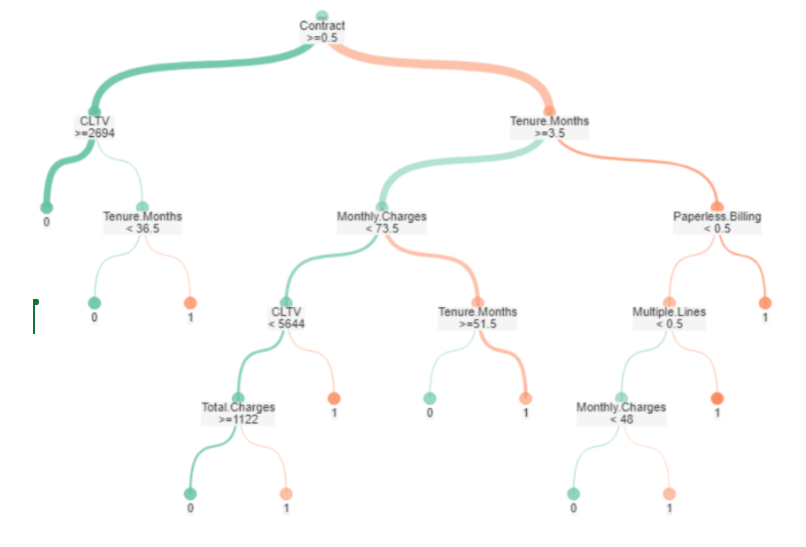
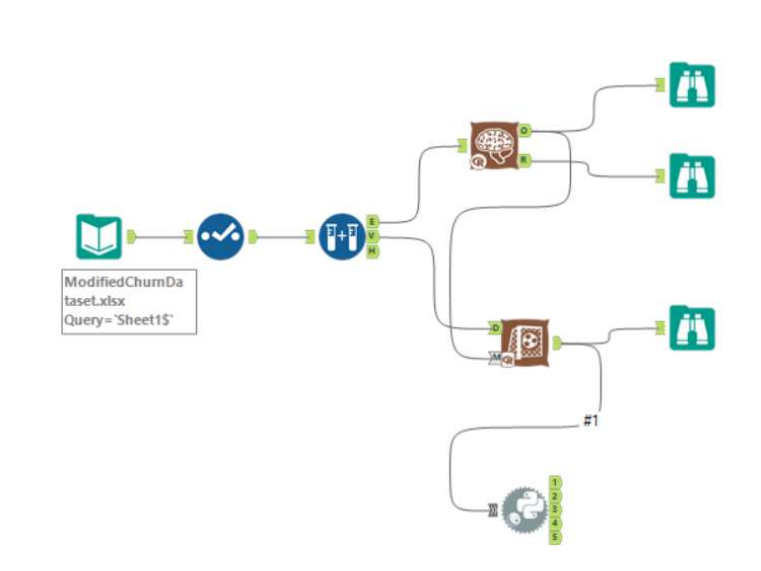
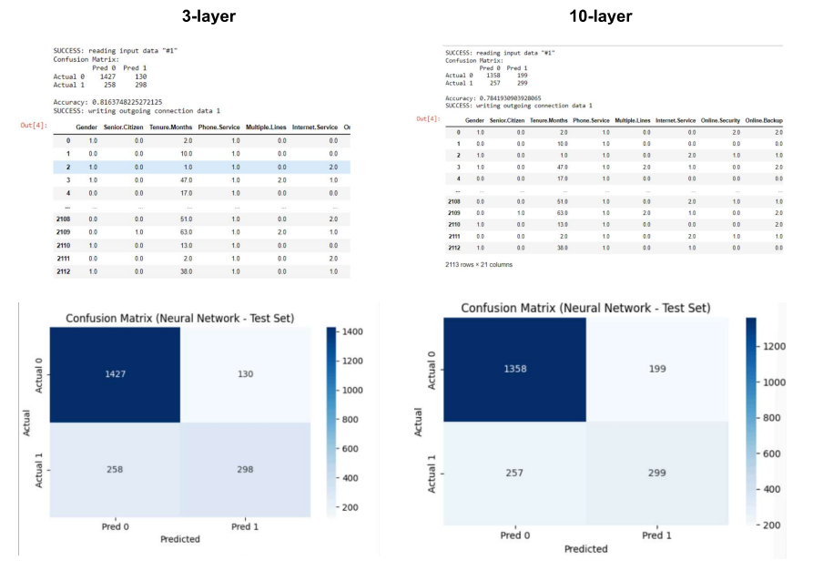

# 📊 Customer Churn Prediction
### Alteryx | Decision Tree | Neural Networks
## Model Output Preview

## 📌 Project Overview

This project focuses on predicting customer churn using a telecom dataset. The objective is to identify customers who are likely to leave the company and understand the key drivers behind churn behavior.

Two machine learning models were developed and compared in Alteryx:
- Decision Tree (Gini Index, Max Depth = 5)
- Neural Network (3-layer and 10-layer architectures)
The project evaluates model performance, interpretability, and generalization capability.

## 🎯 Business Objective

Customer churn directly impacts revenue and customer lifetime value.
This project aims to:
- Predict which customers are likely to churn
- Identify the most influential features driving churn
- Compare model performance and interpretability
- Provide insights to support retention strategies

## 🗂 Dataset

Telecom customer dataset including features such as:
- Contract type
- Tenure (months)
- Monthly charges
- Total charges
- Customer Lifetime Value (CLTV)
- Internet services
- Paperless billing
- Multiple lines
- Senior citizen status

Target variable:
- **Churn Label (1 = churn, 0 = stay)**

The dataset was split into 70% training and 30% test sets.

## ⚙️ Workflow in Alteryx
- The modeling workflow included:
- Data preprocessing and cleaning
- Feature selection
- Train-test split
- Decision Tree modeling
- Neural Network modeling
- Score tool for evaluation
- Python tool for accuracy and confusion matrix analysis
- Model comparison and interpretation

Full workflow file included in this repository.

## 🌳 Model 1: Decision Tree
- Gini Index splitting
- Maximum depth = 5 (to avoid overfitting)
- Interpretable structure
- Pruning analysis performed

**Key Findings:**
- Contract type was the most influential feature
- Tenure, CLTV, and Monthly Charges were strong predictors
- Accuracy ≈ 0.75

The tree provided clear insight into how churn decisions are made.

## 🧠 Model 2: Neural Network

Two architectures were tested:

**3-Layer Network**
- Simpler structure
- Accuracy ≈ 0.816
- Better generalization
- More stable residual distribution

**10-Layer Network**
- More complex architecture
- Accuracy ≈ 0.784
- Signs of overfitting
- Higher objective function value

**Key Insight:**

The simpler 3-layer network outperformed the deeper model, suggesting that increasing complexity did not improve generalization for this dataset.

## 📊 Model Comparison
| Model	| Accuracy	| Notes |
| :--: | :--: | :--:|
| Decision Tree 	| ~0.75	| Interpretable, business-friendly |
| Neural Net (3-layer)	| 0.816	Best overall performance |
| Neural Net (10-layer)	| 0.784	Overfitting observed |

## 📈 Key Insights
- Long-term contracts reduce churn probability.
- Short tenure customers are at higher risk.
- Higher monthly charges correlate with churn risk.
- Simpler neural networks may outperform deeper models when data complexity does not justify deeper architectures.
- Model interpretability and generalization must be balanced.

## 🛠 Tools & Technologies
- Alteryx
- Decision Tree (Gini Index)
- Neural Networks
- Python (accuracy & confusion matrix)
- Model pruning

## 🚀 What This Project Demonstrates
- End-to-end ML workflow in Alteryx
- Model comparison and evaluation
- Overfitting detection
- Hyperparameter experimentation
- Business interpretation of ML results
- Strong analytical reasoning beyond accuracy scores
  
Dataset Source: IBM Telco Customer Churn Dataset  
Full dataset available at: [https://www.kaggle.com/datasets/blastchar/telco-customer-churn]
